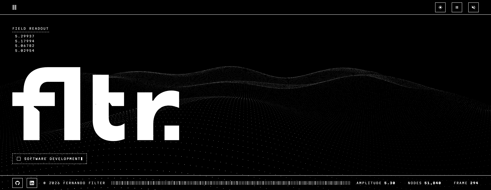

<picture>
  <source media="(prefers-color-scheme: dark)" srcset="docs/assets/hero-dark.png">
  <source media="(prefers-color-scheme: light)" srcset="docs/assets/hero-light.png">
  
</picture>

<sub><a href="README.md">English</a> · Português</sub>

# fltr

[](https://fltr.com.br)


**fltr** é um projeto pessoal, atualmente em desenvolvimento.

Este repositório guarda o código-fonte da sua landing page, no ar em
**[fltr.com.br](https://fltr.com.br)**.

## Rodar

```bash
npm install && npm run dev
```

## Licença

© 2026 Fernando Filter. Todos os direitos reservados.
